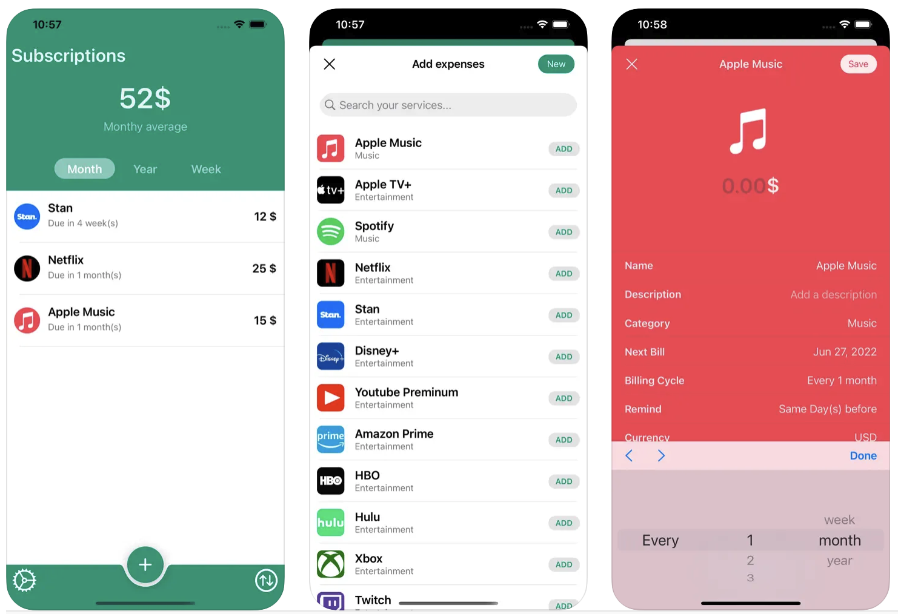
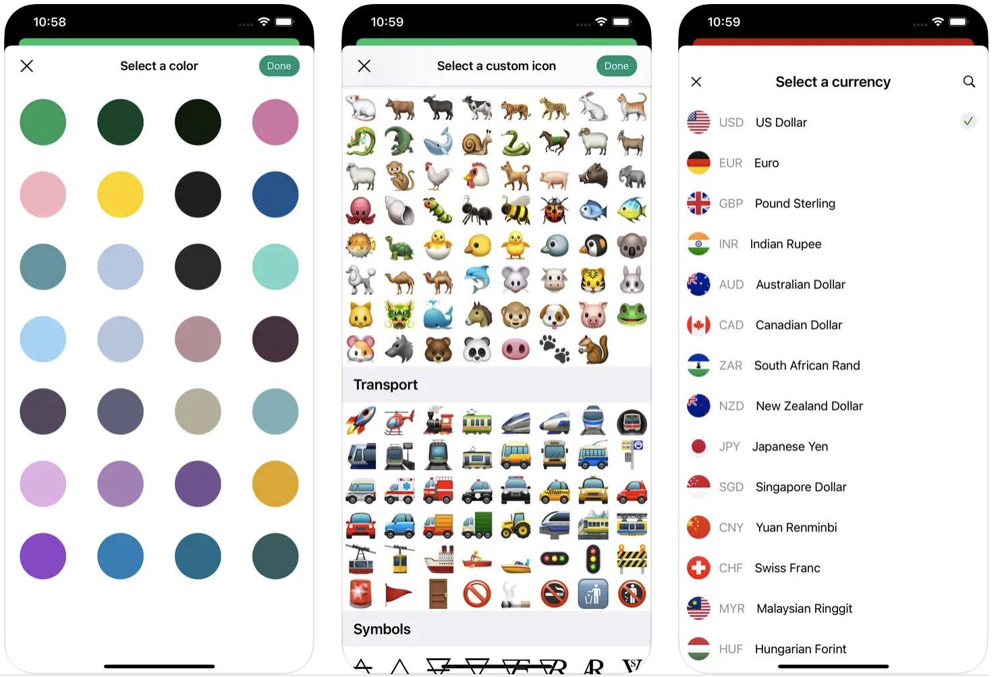

# SubscriptionsManager
Subscriptions & Expenses tracker.
Easy overview
Auto sync with iCloud

Easy to have overview to keep track of your expenses and subscriptions with local push notification reminder if you choose to enable it.

All of data is store locally and sync to your iCloud account.

## Available today

## Built with
* UIKit
* CloudKit & CoreData
* [Eureka](https://github.com/xmartlabs/Eureka)
* [FlagKit](https://github.com/madebybowtie/FlagKit)